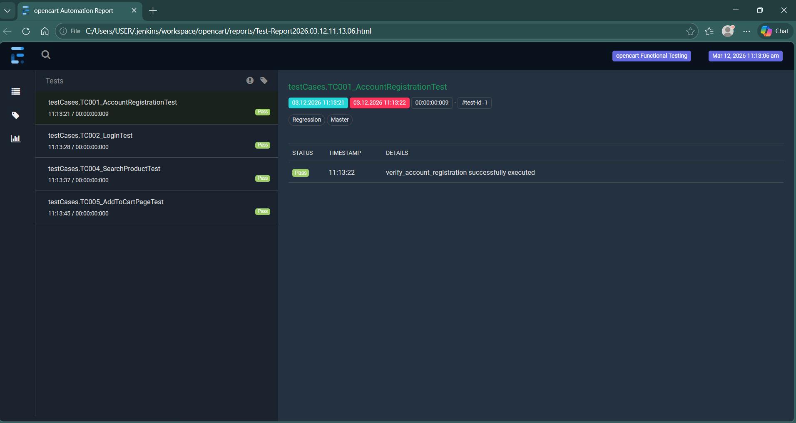

# Selenium Automation Framework – OpenCart

## Project Overview
This project is a Selenium-based UI automation framework, with CI/CD integration designed to test key eCommerce user journeys on the OpenCart platform.

## Tech Stack
- Java
- Selenium WebDriver
- TestNG
- Extent Reports
- Maven

## Test Scenarios
1. Account Registration
2. User Login
3. Login Data Driven Test
4. Product Search
5. Add Product to Cart

## Framework Features
- Page Object Model (POM)
- Data-driven testing
- Cross-browser testing
- Selenium Grid execution
- Docker-based test infrastructure
- Extent Reports for test reporting
- Maven build management
- TestNG test orchestration
- Reusable test utilities
- Scalable test structure

## Project Structure 

```tree
src
 ├── main
 └── test
      ├── pageObjects
      ├── testBase
      ├── testCases
      └── utilities
```
Additional directories:
```tree
reports/        → Extent test reports
screenshots/    → Failure screenshots
logs/           → Execution logs
testData/       → Test data files
```

## Test Execution

This automation framework supports multiple execution strategies including **local execution, cross-browser testing, Selenium Grid execution with Docker, and batch execution**.

Clone the repo:

git clone https://github.com/Sithabilea/OpencartV121.git


### 1.  Run Tests Locally

Run using Maven:

```bash
mvn clean test
```

This will execute the default **TestNG suite** defined in `testng.xml`


### 2. Run Specific Test Suite


You can run a specific TestNG suite file:


```bash
mvn test -DsuiteXmlFile=master.xml
```

### 3. Cross-Browser Testing


To run the same tests across multiple browsers (e.g. Chrome and Firefox):


```bash
mvn test -DsuiteXmlFile=crossbrowsertesting.mxl
```

This configuration allows the framework to execute tests on multiple browsers using **TestNG parameters**


### 4. Run Tests on Selenium Grid with Docker

This project supports distributed test execution using **Selenium Grid** running inside **Docker** containers.

#### 4.1. Start the Selenium Grid

```bash
docker-compose up
```

This will start:

* Selenium Hub
* Browser nodes (Chrome/Firefox)


#### 4.2. Execute Tests on the Grid


```bash
mvn test -DsuiteXmlFile=grid-docker.xml
```

Tests will be distributed across the available browser nodes.


### 5. Run Tests Using Batch File


For convenience, tests can also be executed using the provided batch script:

```bash
run.bat
```

This script triggers the Maven test execution and runs the configured TestNG suite.


---

## Test Execution Extent Reports Screenshot

